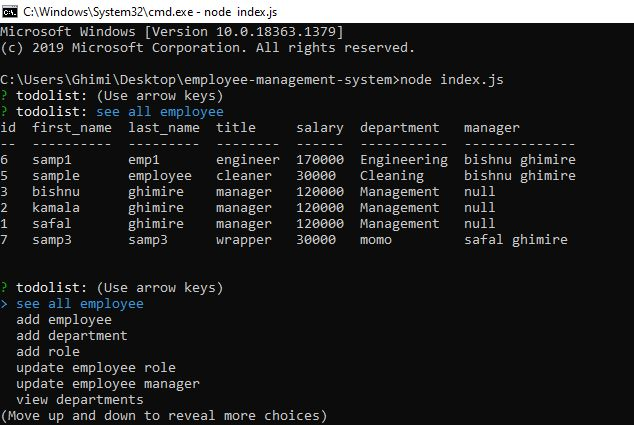

# employee-management-system
# Table of Contents
- [Description](#Description)
- [Technologies](#Technologies)
- [Installation](#Installation)
- [Usage](#Usage)
- [Deployment](#Deployment)
- [Screenshots](#Screenshots)
# Description
  **employee-management-system** is a command line program which allows user to create, update, delete the department, roles and employees and allows to view employee, budget by department, role and manager.
  # Technologies 
  - Node
  - My sQL
  - Console Table 
  - Inquirer
 # Installation
 Need to have node install on local machine.
 - clone the repo 
 - install dependencies 
 # Usage
 - After finishing the installation navigate through `index.js` file in external or internal terminal and run command `node index.js' 
 - follow the procedure comes after
 # Deployment 
 This app is command line so it is not deployed but here is the demo video.
  [link-to-demo-video](https://drive.google.com/file/d/161N2Ae4OCAyB4F4L-7Z5Gc3AnqLYUnuo/view)
# Screenshots 
 
 
 

